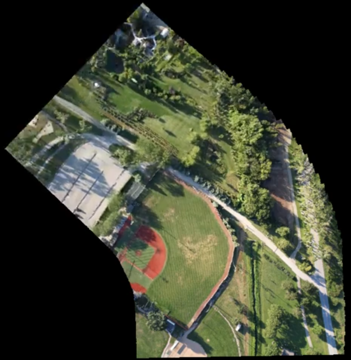

# Drone Mapper - Système de Cartographie Aérienne par Assemblage d'Images en Temps Réel

Ce projet implémente un système de cartographie aérienne en temps réel,
capable de générer une vue d'ensemble à partir d'un flux vidéo de drone en mouvement.

### [Cliquez ici pour voir la démonstration vidéo](https://github.com/MaximeFehrenbach/Drone_Mapper/raw/refs/heads/main/map_result.mp4)

  

## Fonctionnalités
* **Extraction de Caractéristiques (ORB)** : Utilisation de l'algorithme ORB pour détecter et suivre des points d'intérêt robustes sur le terrain.
* **Estimation de Mouvement (Affine)** : Calcul de la transformation géométrique entre les images (translation et rotation) pour un alignement précis via `estimateAffinePartial2D`.
* **Correction de Bordures (Érosion)** : Application de masques morphologiques pour supprimer les artéfacts de bordure et les lignes noires lors de la fusion.
* **Architecture OOP** : Code modulaire structuré en classes (`Mapper.cpp / .hpp`) pour une meilleure lisibilité du code.
* **Optimisation de Performance** : Traitement sous-échantillonné (resize 0.2x) et saut d'images (1/50) pour garantir une exécution fluide en temps réel.
* **Cartographie Incrémentale** : Accumulation des transformations dans une carte globale de 1000x1000 pour reconstruire le parcours du drone.

## Configuration
Le projet est conçu pour être flexible et s'adapter à différents scénarios d'utilisation :

### 1. Paramètres de détection
Dans `Mapper.cpp`, vous pouvez ajuster la sensibilité pour optimiser la vitesse ou la précision :
* **Nombre de points** : `ORB::create(100)` configuré pour une détection rapide sur des flux vidéo HD.
* **Filtrage des matches** : Sélection stricte des 20 meilleurs points (tri par distance de Hamming) pour assurer la stabilité du stitching.

### 2. Source vidéo
Le système peut passer d'une analyse de fichier à un flux direct très simplement dans le `main.cpp` :
* **Vidéo (par défaut)** : `cv::VideoCapture cap("video.mp4");`
* **Webcam / Drone Link** : Remplacez le chemin par l'index `0` ou une URL RTSP pour un mapping en direct.

## Technologies utilisées
* **C++ 17**
* **OpenCV 4.12.0**
* **CMake**

## Structure du Projet
* `main.cpp` : Point d'entrée, gestion du flux vidéo et rafraîchissement de l'affichage.
* `Mapper.cpp / .hpp` : Logique métier (calcul ORB, matrices affines, rendu sur carte).
* `DroneVideo.mp4` : Vidéo source pour les tests de cartographie.
* `CMakeLists.txt` : Configuration pour la compilation.

## Analyse des Résultats
- **Carte globale** : La carte se construit au fur et à mesure du déplacement, centrée initialement au point (500, 500).
- **Stabilité** : L'utilisation de RANSAC lors de l'estimation du mouvement permet d'ignorer les éléments mobiles au sol (véhicules, ombres), ce qui est vérifié dans la vidéo de présentation.
- **Fusion d'images** : Le système de masque dynamique (`copyTo` avec masque érodé) permet une fusion propre sans superposition de bordures.

---
*Projet réalisé dans le cadre d'un apprentissage sur la vision par ordinateur, la géométrie projective et l'architecture logicielle OOP.*
